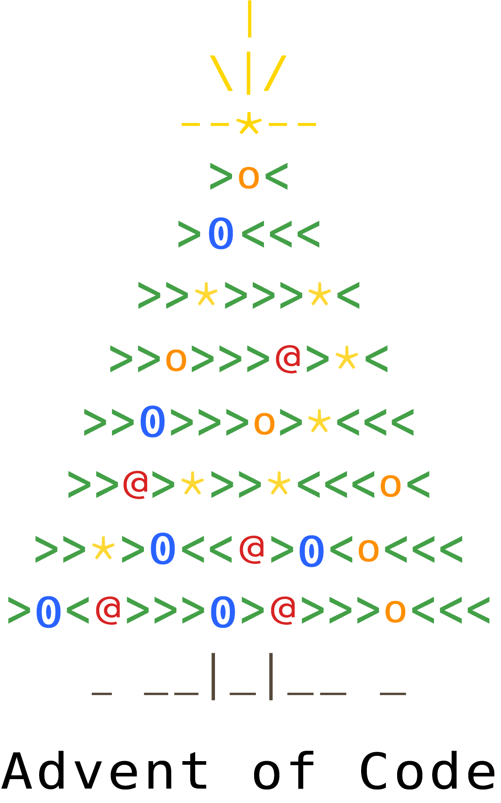

# 
 Advent of Code 

[Advent of Code](https://adventofcode.com/2019/about) is an annual Advent calendar of small programming puzzles that can be solved in any programming language. 
One programming puzzle a day is released from 1st to 25th December, divided in two parts (the second of which is unlocked after solving the first). 
Advent of Code is created by [Eric Wastl](https://twitter.com/ericwastl), and is 100% free. If you like Advent Of Code and want to support its creator, you can
donate to him [here](https://adventofcode.com/2019/support). If you want to hang out with other fellow coders, discuss about puzzles and solutions, or just have a look around, you can
join the official subreddit: [aoc-reddit](https://www.reddit.com/r/adventofcode/)

## My Solutions 

* [2015](src/2015)
* [2016](src/2016)
* [2017](src/2017)
* [2018](src/2018)
* [2019](src/2019)
* [2020](src/2020)
* [2021](src/2021)
* [2022](src/2022)

## Resources 

* [Advent of Code - Official Site](https://adventofcode.com/)
* [Advent of Code walkthroughs](https://github.com/mebeim/aoc)
* [Awesome Advent of Code (collection of resources)](https://github.com/Bogdanp/awesome-advent-of-code)
